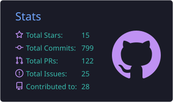
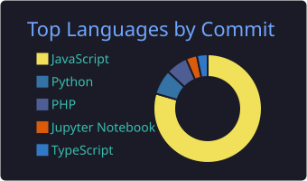

<!-- Header banner -->

<!-- Typing animation -->

 

---

## 👋 About Me

I'm a final-year Software Engineering undergraduate at **SLIIT** with hands-on internship experience building backend services and distributed systems. I enjoy taking services from development through testing to deployment, working in Agile/Scrum teams.

- 🏢 Software Engineering Intern at **RnR Solutions** (Oct 2025 – Mar 2026)
- ⚙️ Focused on **Node.js, REST APIs, microservices and cloud deployment**
- 📨 Experienced with **RabbitMQ, Docker, Kubernetes, CI/CD**, and Azure and GCP virtual machines
- 🧠 Exploring **system architecture & design, agentic AI & LLM applications, and distributed systems**
- 📍 Based in Sri Lanka 🇱🇰

---

## 🛠️ Tech Stack

**Languages**

**Backend & APIs**

**Frontend**

**Cloud & DevOps**

**Databases & Messaging**

---

## 🚀 Featured Projects

<table>
  <tr>
    <td width="33%" valign="top">
      <h3>🏥 MediCare</h3>
      
Healthcare platform built from seven microservices, including an Nginx API gateway and an authentication service. Deployed on Azure VMs with Kubernetes and Docker, JWT auth and CI/CD via Jenkins and GitHub Actions.

      
<code>Spring Boot</code> <code>React</code> <code>MongoDB</code> <code>Docker</code> <code>Kubernetes</code> <code>Azure</code>

      <a href="https://github.com/sadeeshasathsara/MediCare">View repository →</a>
    </td>
    <td width="33%" valign="top">
      <h3>🔌 Workflow Automation Framework</h3>
      
Plugin-based microkernel backend with a minimal core, dynamically loaded plugins and asynchronous event processing, plus a React workflow editor and unit, integration and functional tests.

      
<code>Python</code> <code>FastAPI</code> <code>React</code> <code>SQLite</code>

      <a href="https://github.com/sadeeshasathsara/Workflow-Automation-Platform-with-Plug-in-Architecture">View repository →</a>
    </td>
    <td width="33%" valign="top">
      <h3>♻️ Resource Management Platform</h3>
      
Full-stack platform with a layered architecture, JWT authentication, RBAC authorization and Spring Data JPA with MySQL.

      
<code>Spring Boot</code> <code>React</code> <code>MySQL</code>

      <a href="https://github.com/sadeeshasathsara/smartcycle-backend">Backend →</a> ·
      <a href="https://github.com/sadeeshasathsara/smart-cycle-frontend">Frontend →</a>
    </td>
  </tr>
</table>

---

## 📊 GitHub Stats

---

## 🤝 Let's Connect

I'm open to **software engineering opportunities**, especially in backend, cloud and distributed systems. Feel free to reach out at **sathsarakumbukage@gmail.com** or through [LinkedIn](https://www.linkedin.com/in/sadeeshasathsara).

